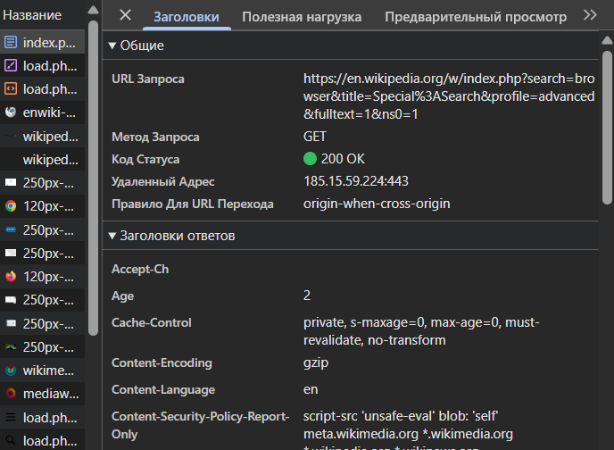

# Отчёт по лабораторной работе.

## Анализ HTTP-запросов

---

#  Задание 1. Анализ HTTP-запросов (Часть 1)

## 1️. Открытие страницы

Адрес:

```
https://en.wikipedia.org/wiki/HTTP
```

После обновления страницы во вкладке **Network** первый запрос — это основной запрос на загрузку HTML-документа.

---

## Анализ первого запроса

### URL запроса

```
https://en.wikipedia.org/wiki/HTTP
```

---

### Метод запроса

```
GET
```

**Почему используется GET?**

Метод `GET` применяется для получения данных с сервера.
При загрузке веб-страницы браузер запрашивает HTML-документ, не изменяя данные на сервере.

---

### Статус ответа

```
200 OK
```

**Что означает?**

Сервер успешно обработал запрос и вернул содержимое страницы.

---

### Заголовки запроса

```
Host: en.wikipedia.org
User-Agent: Mozilla/5.0 ...
Accept: text/html
Accept-Language: ru-RU
```

**Что они означают:**

* **Host** — адрес сервера
* **User-Agent** — информация о браузере
* **Accept** — какие типы данных принимает клиент
* **Accept-Language** — предпочитаемый язык

---

### Заголовки ответа

```
Content-Type: text/html; charset=UTF-8
Content-Length: 71196
Server: ATS/9.2.11
Date: Sat, 14 Feb 2026 06:55:03 GMT
Cache-Control: private, s-maxage=0, max-age=0, must-revalidate, no-transform
```

* **Content-Type** — тип возвращаемого файла
* **Content-Length** — размер ответа
* **Server** — информация о сервере
* **Cache-Control** — правила кэширования

---

### Тело запроса

У GET-запроса **нет тела**.

---

### Тело ответа

HTML-код страницы Wikipedia.

---

### Дополнительные запросы

При загрузке страницы также отправляются:

* CSS-файлы
* JavaScript
* изображения
* шрифты
* favicon

Это необходимо для корректного отображения страницы.

---

## Переход по неверному адресу

```
https://en.wikipedia.org/wiki/HTTPdsfdfs
```

### Статус ответа:

```
404 Not Found
```

**Почему?**

Такой страницы не существует на сервере.

---

# Задание 2. Анализ HTTP-запросов (Часть 2)

## Поиск слова "browser"

Адрес страницы поиска:

```
https://en.wikipedia.org/wiki/Special:Search
```

---

## Анализ запроса поиска

### URL запроса

Пример:

```
https://en.wikipedia.org/w/index.php?search=browser&title=Special%3ASearch&profile=advanced&fulltext=1&ns0=1
```

---

### Метод запроса

```
GET
```

**Почему GET?**

Поиск не изменяет данные на сервере.
Параметры передаются в URL.

---

### Query Parameters
| Параметр  | Значение           | Назначение                                                            |
| --------- | ------------------ | --------------------------------------------------------------------- |
| `search`  | `browser`          | Поисковый запрос, введённый пользователем                             |
| `title`   | `Special%3ASearch` | Указание специальной страницы поиска (`%3A` = `:` → `Special:Search`) |
| `profile` | `advanced`         | Расширенный режим поиска                                              |
| `ns0`     | `1`                | Пространство имён №0 — поиск среди обычных статей                     |



# Задание 3. Анализ HTTP-запроса (пример: github.com)

## Адрес:

```
https://github.com
```

### Метод:

```
GET
```

### Статус:

```
200 OK
```

### Особенности:

* Используется HTTPS
* Много дополнительных API-запросов
* Загружаются JS-скрипты
* Используются cookie для авторизации

---

# Задание 4. Составление HTTP-запросов

---

## 1. GET-запрос

```
GET / HTTP/1.1
Host: sandbox.usm.com
User-Agent: Fiodor Garizan
```

### Что такое User-Agent?

`User-Agent` — это заголовок, который сообщает серверу информацию о клиенте (браузере, программе или устройстве).

Используется для:

* анализа статистики
* адаптации контента
* фильтрации клиентов

---

## 2️. POST-запрос

```
POST /cars HTTP/1.1
Host: sandbox.usm.com
Content-Type: application/x-www-form-urlencoded
User-Agent: Fiodor Garizan
make=Opel&model=Insignia&year=2017
```

Метод `POST` используется для создания нового ресурса.

---

## 3️. PUT-запрос

```
PUT /cars/1 HTTP/1.1
Host: sandbox.usm.com
User-Agent: Fiodor Garizan
Content-Type: application/json

{
  "make": "Toyota",
  "model": "Corolla",
  "year": 2021
}
```

Метод `PUT` используется для полного обновления ресурса.

---

## Разница между PUT и PATCH

| PUT                          | PATCH                             |
| ---------------------------- | --------------------------------- |
| Обновляет ресурс полностью   | Обновляет частично                |
| Требует передачу всех данных | Передаются только изменяемые поля |

---

## Возможный ответ сервера

```
HTTP/1.1 201 Created
Content-Type: application/json

{
  "id": 5,
  "make": "Toyota",
  "model": "Corolla",
  "year": 2020
}
```

---

## Возможные коды ответа

| Код                       | Когда возникает     |
| ------------------------- | ------------------- |
| 200 OK                    | Успешная обработка  |
| 201 Created               | Ресурс создан       |
| 400 Bad Request           | Ошибка в параметрах |
| 401 Unauthorized          | Не авторизован      |
| 403 Forbidden             | Доступ запрещён     |
| 404 Not Found             | Ресурс не найден    |
| 500 Internal Server Error | Ошибка сервера      |

---

# Дополнительные HTTP-методы

| Метод   | Назначение                       |
| ------- | -------------------------------- |
| GET     | Получение данных                 |
| POST    | Создание ресурса                 |
| PUT     | Полное обновление                |
| PATCH   | Частичное обновление             |
| DELETE  | Удаление ресурса                 |
| HEAD    | Получение только заголовков      |
| OPTIONS | Получение поддерживаемых методов |

---

# Вывод

В ходе работы были изучены:

* структура HTTP-запроса
* методы GET, POST, PUT
* статус-коды
* заголовки запроса и ответа
* параметры запроса
* различия между методами

HTTP является основой работы веб-приложений и обеспечивает взаимодействие клиента и сервера.
