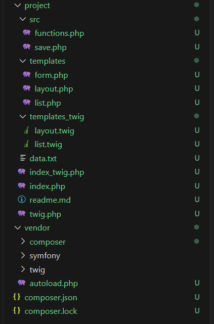

# Лабораторная работа №7  
## Шаблонизация в PHP и Twig

### Цель работы
Освоить принципы шаблонизации в PHP, как с использованием нативных PHP-шаблонов, так и с применением шаблонизатора Twig. Разделить проект на уровни логики и представления.

---

## Структура проекта

---

## Шаг 1. Нативные PHP-шаблоны

### Разделение логики и представления

**Логика (src/):**
- `functions.php` — работа с данными (чтение, сортировка)
- `save.php` — обработка формы и сохранение

**Представление (templates/):**
- `layout.php` — общий шаблон (header, стили)
- `form.php` — форма добавления рецепта
- `list.php` — отображение списка рецептов

### Точка входа

Файл `index.php`:
- получает данные
- сортирует их
- передает в шаблоны через переменные

---

## Шаг 2. Использование Twig

### Подключение Twig

Через Composer:
composer require twig/twig
Настройка (`twig.php`):
- загрузчик шаблонов
- создание окружения Twig
- добавление пользовательского фильтра

### Twig-шаблоны

- `layout.twig` — базовый шаблон
- `list.twig` — наследует layout

Пример наследования:

```twig





``` 
## Шаг 3. Дополнительное задание
### Пользовательский фильтр

Добавлен фильтр format_time:
```php
$filter = new \Twig\TwigFilter('format_time', function ($minutes) {
    $minutes = (int)$minutes;
    return intdiv($minutes, 60) . 'h ' . ($minutes % 60) . 'm';
});
```
Использование:
```twig
{{ recipe.prep_time|default(0)|format_time }}
```

## Сравнение подходов
### Нативные PHP-шаблоны
- Используют обычный PHP внутри HTML
- Простые, не требуют библиотек
- Смешивают код и представление
### Twig
- Чистый синтаксис шаблонов
- Безопасный вывод данных
- Поддержка наследования и фильтров

## Контрольные вопросы

1. В чём отличие нативных PHP-шаблонов от Twig?
PHP-шаблоны позволяют писать любой PHP-код внутри HTML, а Twig ограничивает логику и делает шаблоны чище и безопаснее.

2. Зачем разделять логику и представление?
Разделение упрощает поддержку, повторное использование кода и делает проект более понятным.

3. Что такое наследование шаблонов в Twig?
Это механизм, при котором один шаблон расширяет другой с помощью  и переопределяет блоки через .

## Вывод

В ходе работы проект был переработан с разделением логики и представления, сначала с использованием нативных PHP-шаблонов, затем с применением Twig, что позволило сделать код более структурированным, читаемым и удобным для поддержки.